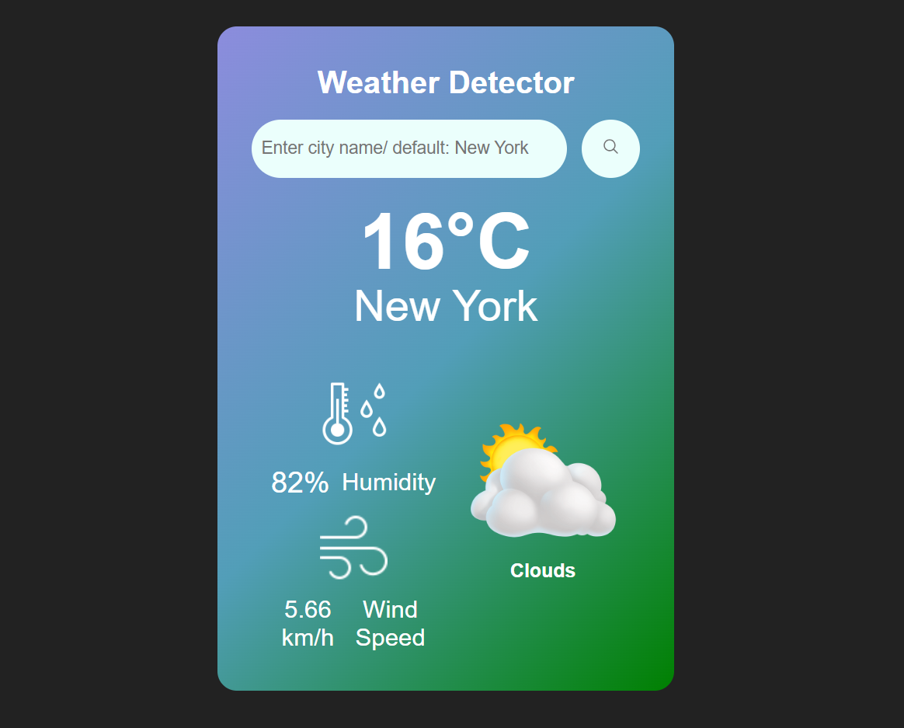

# Weather App Mini Project



## Description

This is a simple Weather App that allows users to check the current weather for any city. The app fetches real-time weather data using a weather API and displays essential information such as temperature, humidity, and weather conditions. It’s designed to be lightweight, user-friendly, and responsive.

## Live Project  
You can view the deployed version here:  
[🔗 Visit Website](https://weather-website-mini-project.netlify.app/)

## Features

- Search weather by city name.

- Displays temperature, humidity, and weather description.

- Dynamic weather icons based on conditions.

- Responsive design for mobile and desktop.

## Technologies Used

- HTML

- CSS

- JavaScript

- [OpenWeatherMap API](https://openweathermap.org/api)
  (or any other weather API)

## How to Use

1. Clone the repository:
   ```bash
      git clone https://github.com/Harsimrankaur2004/weather-mini-project


2. Open index.html in your browser.

3. Enter a city name in the search bar and press Enter.

4. View the current weather information.

## Future Improvements

- Add hourly and weekly forecasts.

- Implement geolocation to detect user’s location automatically.

- Add dark/light mode toggle.

## License

This project is licensed under the MIT License.

[](https://opensource.org/licenses/MIT)


